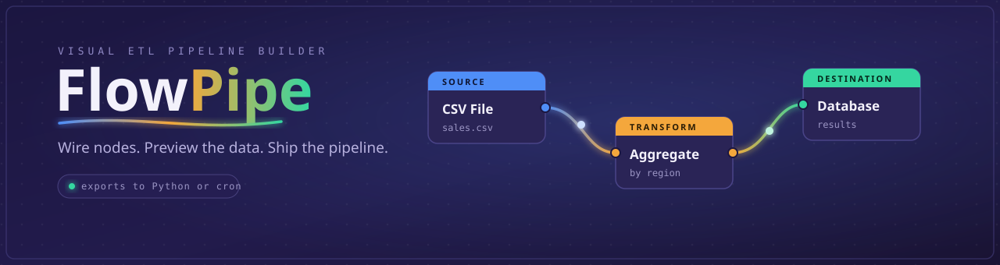

# FlowPipe



A visual ETL builder. Wire nodes together on a canvas, preview the data at each
step, then export the result as a Python script or run it on a cron schedule.

## Install

```bash
pip install -e .
flowpipe          # serves http://127.0.0.1:8100
```

For development use `pip install -e ".[dev]"` and `flowpipe serve --reload`.

## Nodes

20+ nodes in three groups: sources (CSV, Excel, JSON, SQL, sample data),
transforms (filter, select, rename, sort, join, union, group and aggregate,
pivot and unpivot, deduplicate, cast, fill missing, string and date operations,
computed and conditional columns, and an assert/validate gate), and destinations
(file or database). Computed-column expressions run in a safe sandbox, not `eval`.
Drag from the sidebar, connect output ports to input ports, click a node to set
its params, then run. Uploaded files land in `uploads/` and show up in source nodes.

## Command line

Pipelines are plain JSON (`{"nodes": [...], "edges": [...]}`), so they run without
the UI - useful for cron and CI.

```bash
flowpipe nodes                       # list node types
flowpipe validate pipeline.json      # structure, params, expressions (add --schema for column refs)
flowpipe run pipeline.json           # execute; non-zero exit on failure
flowpipe codegen pipeline.json -o out.py
```

`--json` on `run` and `nodes` gives machine-readable output. See
`examples/sales_report.json` for the format.

## API

A FastAPI REST API covers everything the UI does - node types, uploads, runs,
validate, codegen, schedules. See `server.py`.

## License

MIT
